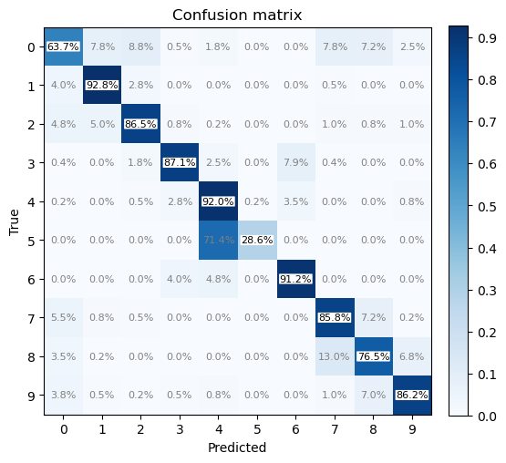
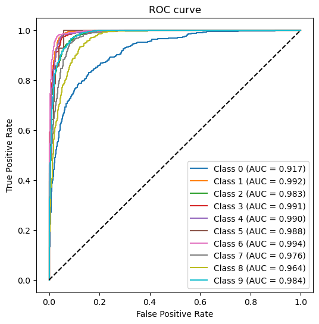
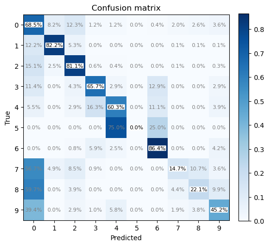
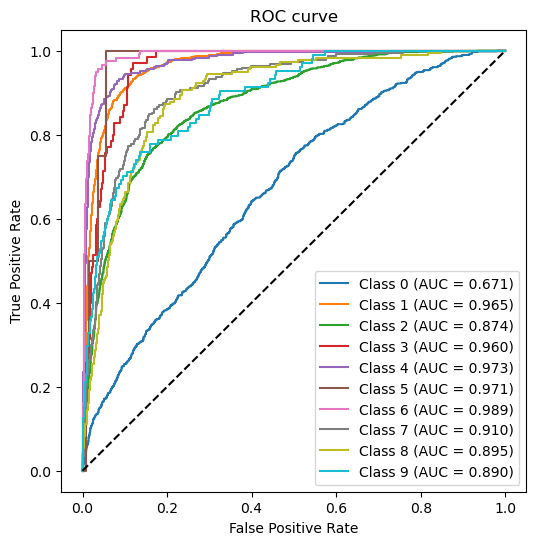
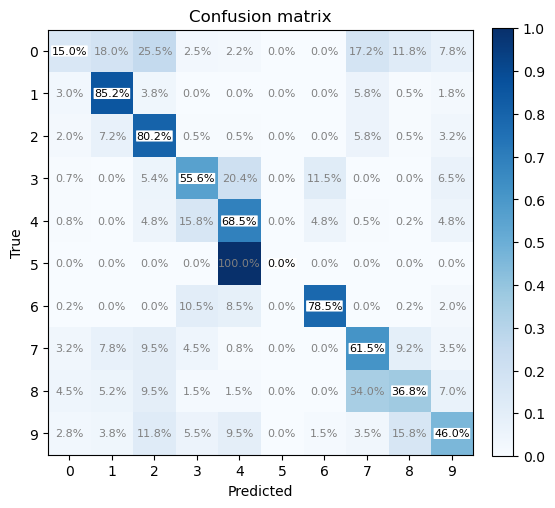
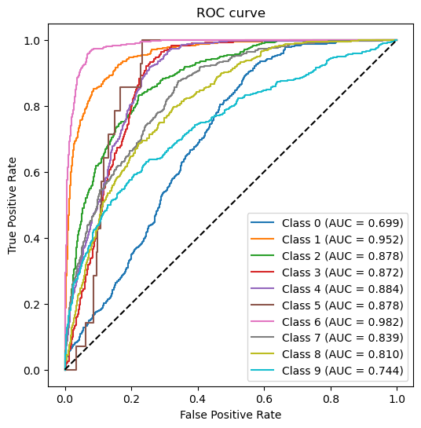

# SDSSGalCat
Galaxy10 SDSS galaxies classification with Deep Learning; A toy project for practicing.

## Result

| Model    | Precision | Recall   | F Score | Epoch |
|----------|-----------|----------|---------|-------|
| CNN      | 55.1%     | 52.6%    | 51.1%   | 32 (*17428) |
| CNN + preprocessing     | 51.8%    | 52.7%   | 50.8% | 64 (*31435) (/8) |
| ResNET18 + FC | 83.9%    | 79.0%   | 80.2% | 16 (*31435) (/8) |

### ResNET18 + FullConnect

16 training epoch, 31435 images per epoch (including 4 rotation * 2 flip per images in Galaxy10)

The dataset was balanced to at most 2000 images per class.

A full connect layer (1000->10) was tailed to match the 10 class.

### CNN

32 training epoch, 17428 images per epoch

The dataset was directly used.

### CNN + preprocessing

64 training epoch, 31435 images per epoch (including 4 rotation * 2 flip per images in Galaxy10)

The dataset was balanced to at most 4000 images per class.

## Environment

Use `conda` to manage packages. See `environment_*.yml` for detail. 

In short, we use
- `python 3.11.9`
- `pytorch 2.3.0` (with [mps](https://pytorch.org/docs/stable/notes/mps.html) backend, or `cuda` support), with `torchvision`
- `scikit-learn` for handy analysis
- `matplotlib`, `numpy`, `pandas` for data analysis & visualization
- `h5py` for file I/O
- `tqdm` for progress-bar

The code run successfully on either of the following hardware/system:
- MacBookPro M3Max with 36GB RAM, macOS X
- i5 11400F + RTX 4060Ti 16GB, with 64GB RAM, Windows 11

## Reference

- [Galaxy10 SDSS Dataset](https://ui.adsabs.harvard.edu/abs/2011MNRAS.410..166L/abstract), introduced by [astroNN](https://astronn.readthedocs.io/en/stable/galaxy10sdss.html)
- 戴加明 等, 基于深度卷积神经网络的星系形态分类研究, UCAS

## License
MIT
